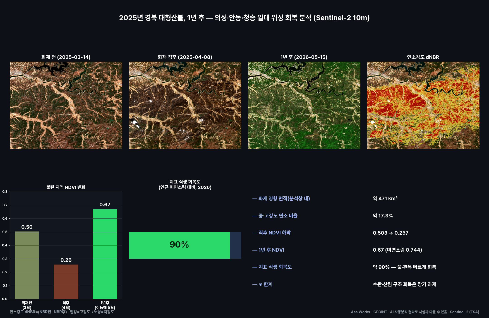

# 특집 — 2025년 경북 대형산불, 1년 후

**발행**: 2026-06-13 07시 · **분석**: AssiWorks - GEOINT  
**대상지**: 경북 의성·안동·청송 일대 (36.32–36.64°N, 128.72–129.18°E) · **센서**: Sentinel-2 L2A (ESA) · 10 m

> ⚠️ **추정치 안내**: 본 콘텐츠의 모든 수치·판정·해석은 AI·알고리즘이 위성영상을 자동 분석한 **추정 결과**로, 사실과 다를 수 있습니다. 공식 통계·현장 확인과 차이가 있을 수 있으므로 참고용으로만 활용하시기 바랍니다.

---

## 요약
2025년 3월 발생한 대형 산불 피해지를 Sentinel-2 위성으로 화재 **전·직후·1년 후** 3시점 비교한 결과입니다.
- 분석창 내 화재 영향 면적 **약 471 km²**.
- 중·고강도 연소 비율 **
- 불탄 지역 식생지수(NDVI)는 직후 **약 0.261**까지 낮아진 뒤 1년 후 **약 0.667**로 반등.
- 2026년 기준 지표 식생은 인근 미연소림의 **약 88%** 수준까지 회복.
- 다만 NDVI가 반영하는 것은 풀·관목 등 **지표 식생**으로, 수관(樹冠)·산림 구조의 회복은 장기 과제입니다.

## 방법
| 항목 | 내용 |
|---|---|
| 연소강도 | dNBR = NBR(화재전) − NBR(화재후), NBR=(B08−B12)/(B08+B12) |
| 시점 | 전 2025-03-14 · 직후 2025-04-08 · 1년후 2026-05-15 (구름 ≤5%) |
| 회복 지표 | 불탄지 NDVI 시계열 + 인근 미연소림 대비 비율 |

## 분석 종합

## 시점별 트루컬러
| 화재 전 (2025-03) | 화재 직후 (2025-04) | 1년 후 (2026-05) |
|---|---|---|
|  |  |  |

## 연소강도 지도 (dNBR)

## 영상카드
- [`wildfire_wf1_story.mp4`](videocards/wildfire_wf1_story.mp4) — 화재 전→직후→1년 후
- [`wildfire_wf2_severity.mp4`](videocards/wildfire_wf2_severity.mp4) — 연소강도
- [`wildfire_wf3_recovery.mp4`](videocards/wildfire_wf3_recovery.mp4) — 1년 후 회복

---
_AssiWorks - GEOINT · 2026-06-13 07시 · Sentinel-2 (ESA)_
