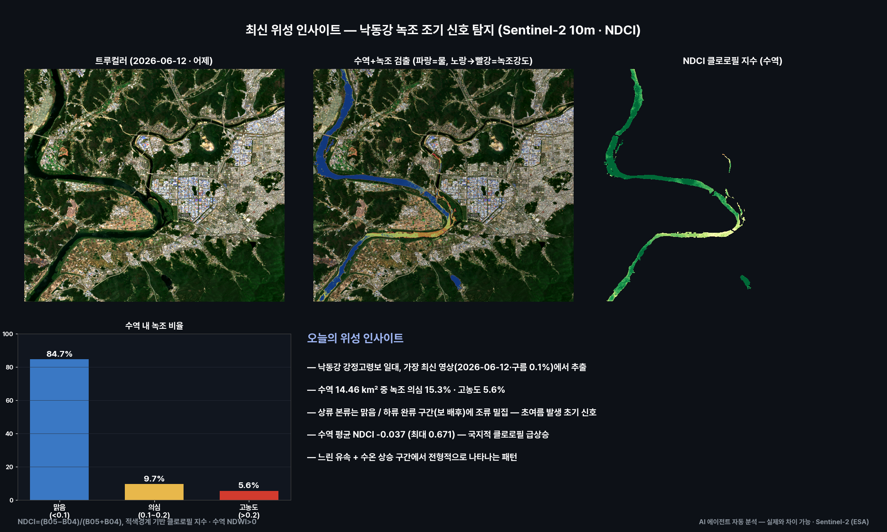
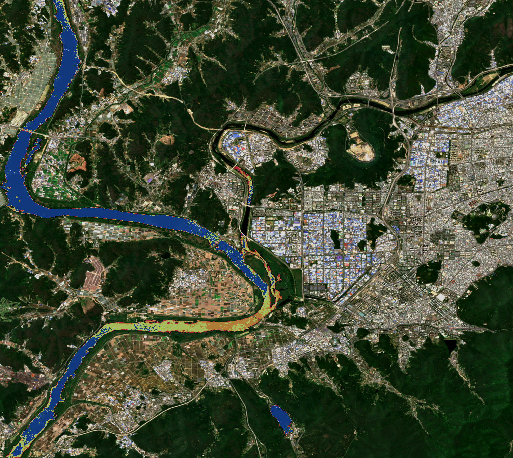

# 최신 위성 인사이트 — 낙동강 녹조 신호

**발행**: 2026-06-13 19시 · **센서**: Sentinel-2 L2A (ESA) · 10 m  
**대상**: 낙동강 강정고령보 일대 (대구, 35.76–35.93°N, 128.38–128.57°E) · **원본 촬영**: 2026-06-12 (구름 0.1%)

> ⚠️ **추정치 안내**: 본 콘텐츠의 모든 수치·판정·해석은 AI·알고리즘이 위성영상을 자동 분석한 **추정 결과**로, 사실과 다를 수 있습니다. 공식 통계·현장 확인과 차이가 있을 수 있으므로 참고용으로만 활용하시기 바랍니다.

---

## 핵심 인사이트
'과거 대비 변화'가 아니라 **가장 최신 한 장의 영상에서 새로운 신호를 찾는** 접근입니다.
- 최신 영상(2026-06-12)에서 **녹조로 보이는 신호** 포착.
- 수역 약 **14.46 km²** 중 녹조 의심(NDCI>0.1) **약 15.3%**, 고농도(>0.2) **약 5.6%**.
- 상류 본류는 비교적 맑고, 하류 완류 구간(보 배후)에 신호가 집중되는 경향.
- 수역 평균 NDCI 약 -0.037, 국지 최대 약 0.671.
- ※ NDCI 신호는 수심·탁도·수생식물 등으로도 나타날 수 있어, 실제 녹조 여부는 현장 확인이 필요합니다.

## 방법
| 항목 | 내용 |
|---|---|
| 클로로필 지수 | NDCI = (B05−B04)/(B05+B04), 적색경계(705nm) 기반 |
| 수역 마스크 | NDWI=(B03−B08)/(B03+B08) > 0 |
| 등급 | 의심 0.1≤NDCI<0.2 · 고농도 NDCI≥0.2 |

## 분석 종합

## 수역 + 녹조 신호

## 영상카드
- [`insight_nakdong_algae.mp4`](videocards/insight_nakdong_algae.mp4)

---
_AssiWorks - GEOINT · 2026-06-13 19시 · Sentinel-2 (ESA)_
