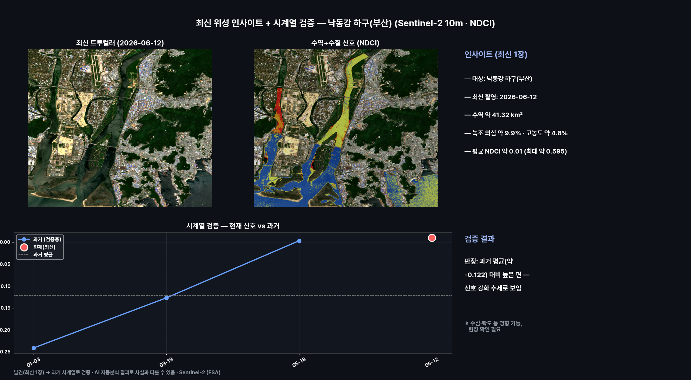
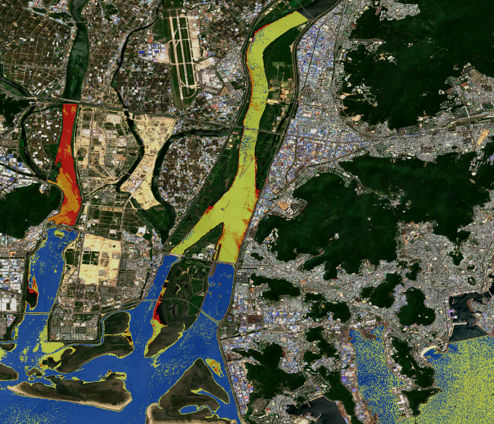

# 최신 위성 인사이트 — 낙동강 하구(부산) 수질 신호

**발행**: 2026-06-14 06시 · **센서**: Sentinel-2 L2A (ESA) · 10 m
**대상**: 낙동강 하구(부산) · **원본 촬영**: 2026-06-12 (가장 최신)

> ⚠️ **추정치 안내**: 본 콘텐츠의 모든 수치·판정·해석은 AI·알고리즘이 위성영상을 자동 분석한 **추정 결과**로, 사실과 다를 수 있습니다. 공식 통계·현장 확인과 차이가 있을 수 있으므로 참고용으로만 활용하시기 바랍니다.

---

## 1단계 — 발견 (최신 1장)
가장 최신 한 장의 영상에서 새 신호를 찾는 접근입니다.
- 2026-06-12 촬영 영상에서 수질(클로로필) 신호 분석.
- 수역 약 **41.32 km²** 중 녹조 의심(NDCI>0.1) **약 9.9%**, 고농도 **약 4.8%**.
- 수역 평균 NDCI 약 0.01, 국지 최대 약 0.595.

## 2단계 — 시계열 검증
발견한 신호가 실제로 의미 있는지, **동일 지역의 과거 청천 영상(3개)과 비교**해 검증합니다.
- 과거 NDCI: 01-03 -0.241, 03-19 -0.127, 05-18 0.003
- 현재: 06-12 약 0.01
- **판정: 과거 평균(약 -0.122) 대비 **높은 편** — 신호 강화 추세로 보임**
- ※ NDCI 신호는 수심·탁도·수생식물 등으로도 나타날 수 있어 현장 확인이 필요합니다.

## 분석 종합 (발견 + 검증)

## 수역 + 수질 신호

## 영상카드
- [`insight_card.mp4`](videocards/insight_card.mp4)

---
_AssiWorks - GEOINT · 2026-06-14 06시 · Sentinel-2 (ESA)_
