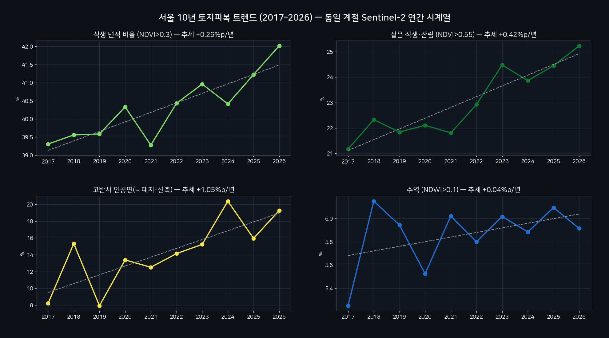
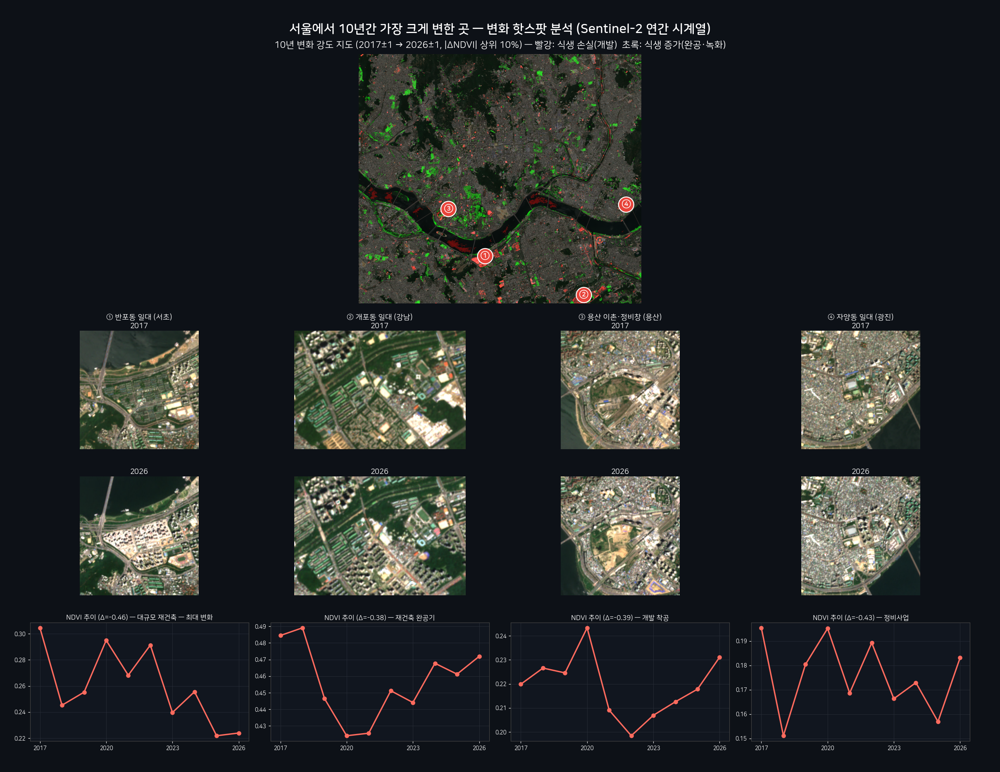

# 서울 한강 일대 위성 변화 분석 — 10년 시계열

**발행**: 2026-06-14 06시 · **센서**: Sentinel-2 L2A (ESA Copernicus) · 10 m  
**대상지**: 서울 한강 일대 (37.48–37.62°N, 126.90–127.10°E) · 약 18×16 km

> ⚠️ **추정치 안내**: 본 콘텐츠의 모든 수치·판정·해석은 AI·알고리즘이 위성영상을 자동 분석한 **추정 결과**로, 사실과 다를 수 있습니다. 공식 통계·현장 확인과 차이가 있을 수 있으므로 참고용으로만 활용하시기 바랍니다.

---

## 1. 요약

- 분석 기간 **2017–2026** (10년), 동일 계절 청천 영상으로 구성한 시계열.
- 식생 면적(NDVI>0.3): 약 39.3% → 약 42.0% (추세 +0.26%p/년).
- 짙은 식생(NDVI>0.55): 약 21.2% → 약 25.2% (추세 +0.42%p/년).
- 수역(한강): 약 5.2% → 약 5.9% (큰 변화 없음).
- 변화가 두드러진 핫스팟 약 **12곳** 분석.

## 2. 데이터·방법

| 항목 | 내용 |
|---|---|
| 소스 | Sentinel-2 L2A COG (AWS Earth Search STAC) |
| 지수 | NDVI, NDWI / 분류 K-means+Swin(EuroSAT) |
| 변화탐지 | 연간 NDVI 앞2·뒤2년 평균차 + 핫스팟 |

## 3. 10년 트렌드

| 연도 | 식생 | 짙은식생 | 수역 |
|---|---|---|---|
| 2017 | 39.3% | 21.2% | 5.2% |
| 2018 | 39.6% | 22.3% | 6.2% |
| 2019 | 39.6% | 21.8% | 5.9% |
| 2020 | 40.3% | 22.1% | 5.5% |
| 2021 | 39.3% | 21.8% | 6.0% |
| 2022 | 40.4% | 22.9% | 5.8% |
| 2023 | 41.0% | 24.5% | 6.0% |
| 2024 | 40.4% | 23.9% | 5.9% |
| 2025 | 41.2% | 24.5% | 6.1% |
| 2026 | 42.0% | 25.2% | 5.9% |

_위 값은 NDVI/NDWI 임계 기반 자동 분석값으로 오차를 포함합니다._

## 4. 변화가 두드러진 곳

| # | 위치 | 면적(km²) | ΔNDVI |
|---|---|---|---|
| 1 | 37.5049, 126.9861 | 0.33 | -0.455 |
| 2 | 37.483, 127.0559 | 0.09 | -0.381 |
| 3 | 37.5016, 126.9877 | 0.08 | -0.374 |
| 4 | 37.5314, 126.96 | 0.08 | -0.386 |
| 5 | 37.6094, 127.0281 | 0.07 | +0.371 |
| 6 | 37.5531, 126.9496 | 0.06 | +0.336 |
| 7 | 37.4819, 126.9997 | 0.06 | -0.373 |
| 8 | 37.4819, 127.0619 | 0.06 | +0.330 |

## 5. 시각 자료

**10년 연간 그리드**

**토지피복 트렌드 차트**

**변화 핫스팟 지도**

**딥러닝 픽셀 분류**

**10년 타임랩스**

**영상카드**

- [`card_1_seoul-10yr.mp4`](videocards/card_1_seoul-10yr.mp4)
- [`card_2_change-pixels.mp4`](videocards/card_2_change-pixels.mp4)
- [`card_3_banpo.mp4`](videocards/card_3_banpo.mp4)
- [`card_4_gaepo.mp4`](videocards/card_4_gaepo.mp4)
- [`card_5_yongsan.mp4`](videocards/card_5_yongsan.mp4)
- [`card_6_trend.mp4`](videocards/card_6_trend.mp4)

---
_AIFactory GEOINT Agent · 2026-06-14 06시 · Sentinel-2 (ESA)_