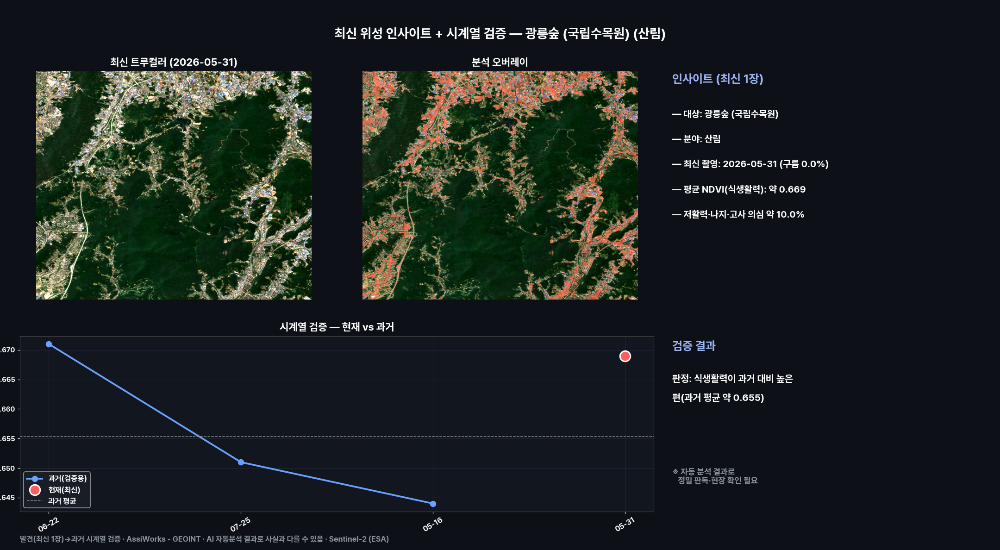
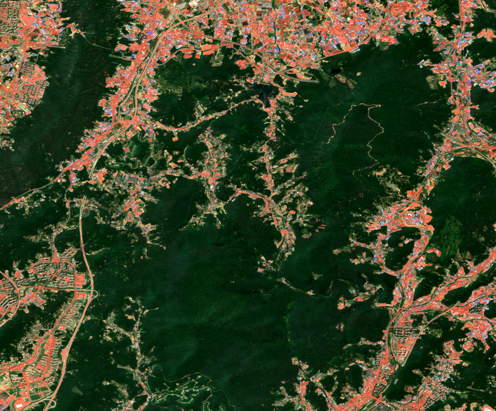
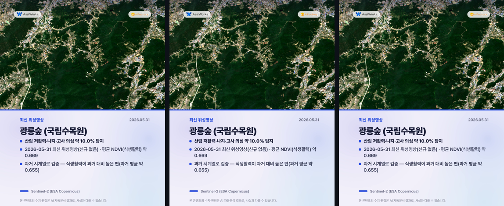
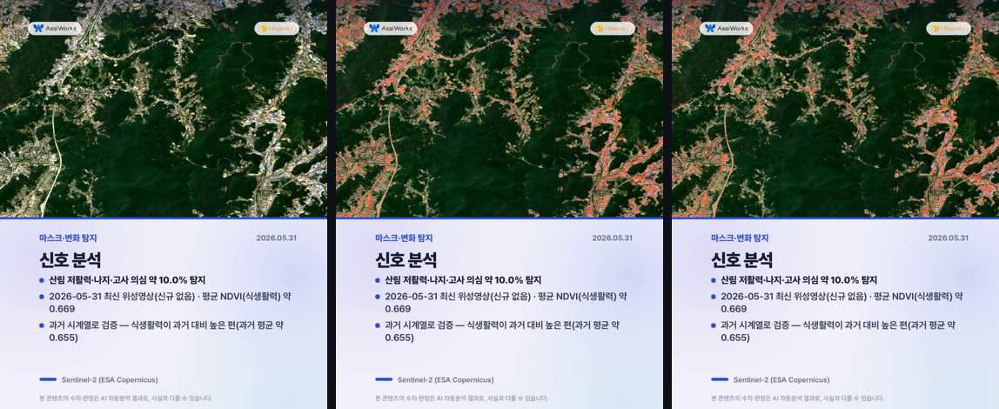
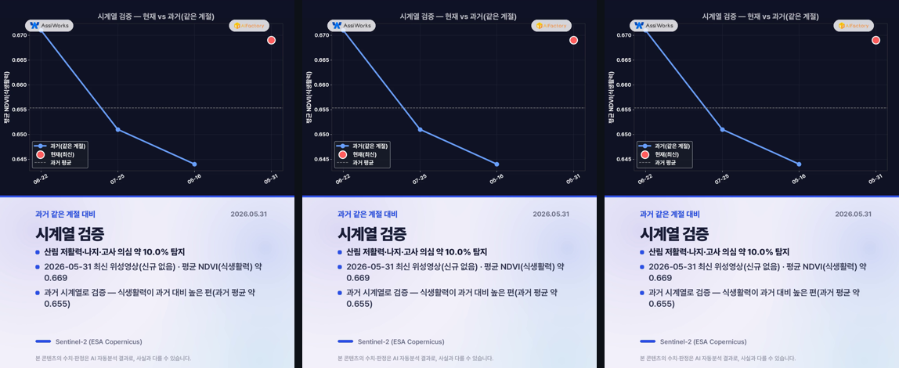
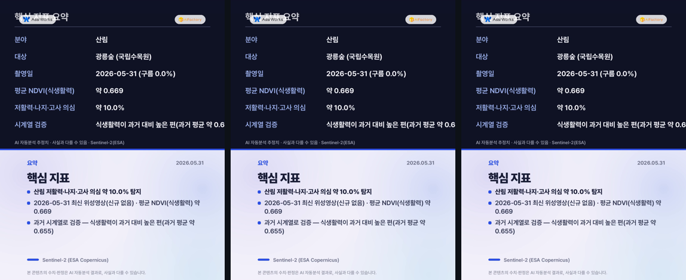
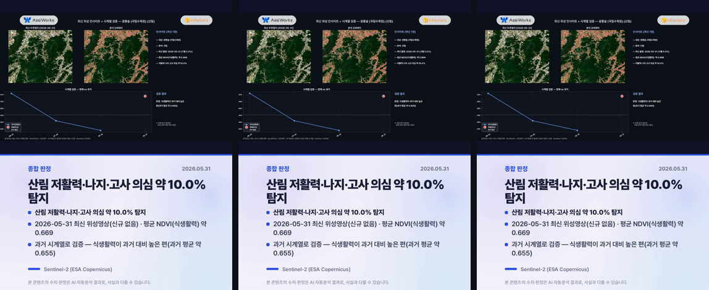

# 최신 위성 인사이트 — 광릉숲 (국립수목원) (산림)

**발행**: 2026-06-15 06시 · **분야**: 산림 · **센서**: Sentinel-2 L2A (ESA) · 10 m
**원본 촬영**: 2026-05-31 (구름 0.0%, 최신 위성영상(신규 장면 없어 최신 영상 사용))

> ⚠️ **추정치 안내**: 본 콘텐츠의 모든 수치·판정·해석은 AI·알고리즘이 위성영상을 자동 분석한 **추정 결과**로, 사실과 다를 수 있습니다. 공식 통계·현장 확인과 차이가 있을 수 있으므로 참고용으로만 활용하시기 바랍니다.

---

## 핵심 발견
> **산림 저활력·나지·고사 의심 약 10.0% 탐지**

## 1단계 — 발견 (최신 1장)
- 2026-05-31 촬영 영상에서 산림 신호 분석.
- 평균 NDVI(식생활력): 약 0.669.
- 산림 식생활력(NDVI) 평균 약 0.669
- 저활력·나지·고사 의심 약 10.0%

## 2단계 — 시계열 검증
동일 지역 과거 청천 영상(3개)과 비교해 검증합니다.
- 과거: 06-22 0.671, 07-25 0.651, 05-16 0.644
- 현재: 05-31 약 0.669
- **판정: 식생활력이 과거 대비 높은 편(과거 평균 약 0.655)**
- ※ 자동 분석 결과로 정밀 판독·현장 확인이 필요합니다. (산사태·불법건축물·해변쓰레기·고사목 등 미세 대상은 고해상 영상 병행 권장)

## 분석 종합 (발견 + 검증)

## 분석 오버레이

## 영상카드 (미리보기)

_아래는 각 영상의 대표 장면입니다. 영상은 링크에서 재생/다운로드._

▶️ [card1_truecolor.mp4 영상 보기](videocards/card1_truecolor.mp4)

▶️ [card2_signal.mp4 영상 보기](videocards/card2_signal.mp4)

▶️ [card3_timeseries.mp4 영상 보기](videocards/card3_timeseries.mp4)

▶️ [card4_table.mp4 영상 보기](videocards/card4_table.mp4)

▶️ [card5_summary.mp4 영상 보기](videocards/card5_summary.mp4)

---
_AssiWorks - GEOINT · 2026-06-15 06시 · Sentinel-2 (ESA)_
