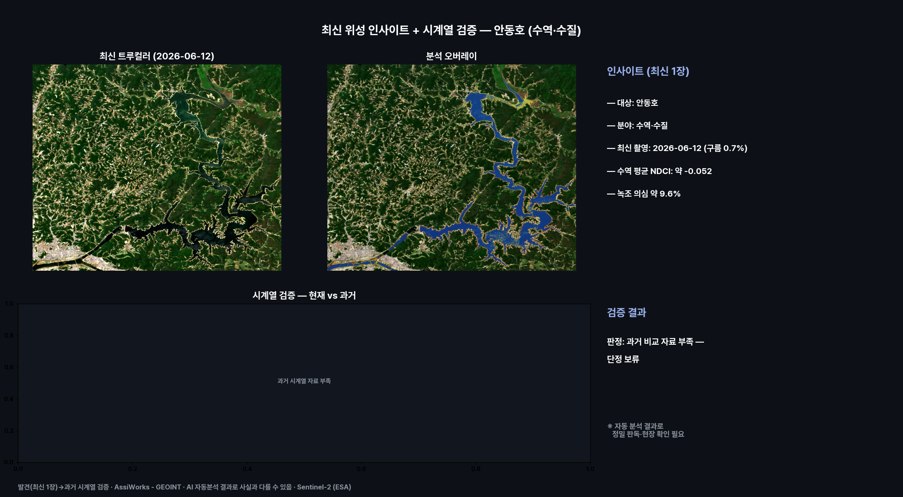
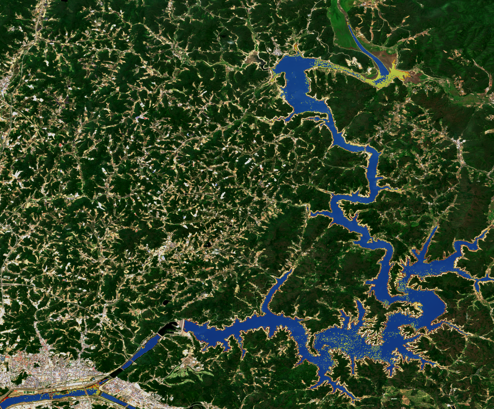
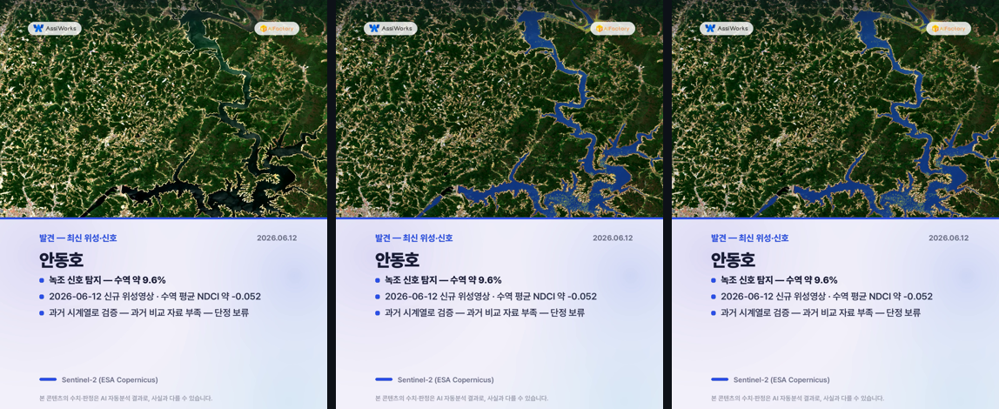
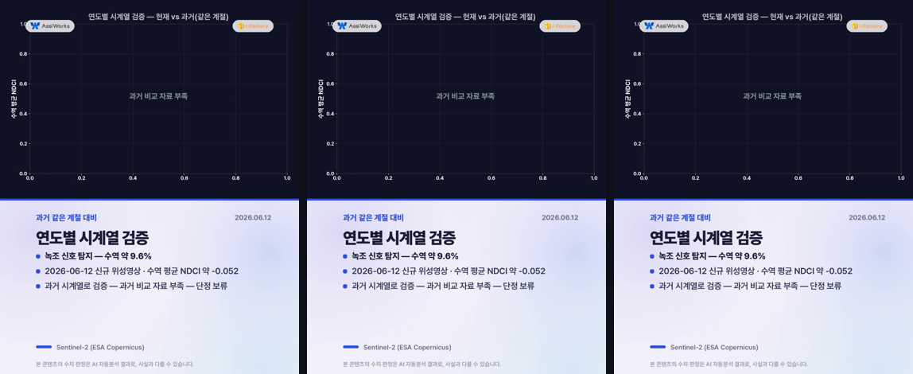
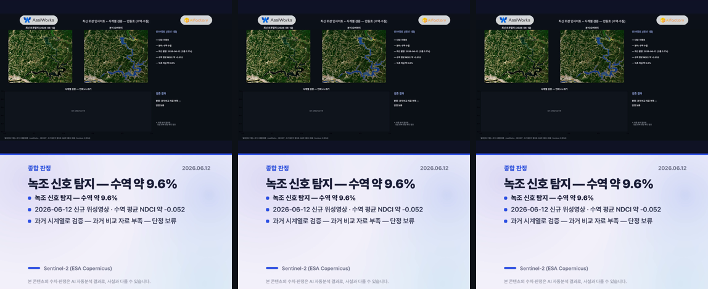

# 최신 위성 인사이트 — 안동호 (수역·수질)

**발행**: 2026-06-15 13시 · **분야**: 수역·수질 · **센서**: Sentinel-2 L2A (ESA) · 10 m
**원본 촬영**: 2026-06-12 (구름 0.7%, 신규 위성영상)

> ⚠️ **추정치 안내**: 본 콘텐츠의 모든 수치·판정·해석은 AI·알고리즘이 위성영상을 자동 분석한 **추정 결과**로, 사실과 다를 수 있습니다. 공식 통계·현장 확인과 차이가 있을 수 있으므로 참고용으로만 활용하시기 바랍니다.

---

## 핵심 발견
> **녹조 신호 탐지 — 수역 약 9.6%**

## 1단계 — 발견 (최신 1장)
- 2026-06-12 촬영 영상에서 수역·수질 신호 분석.
- 수역 평균 NDCI: 약 -0.052.
- 수역 내 녹조 의심 약 9.6% · 고농도 약 4.8%
- 보 배후·완류 구간 신호 집중 여부 점검

## 2단계 — 시계열 검증
동일 지역 과거 청천 영상(0개)과 비교해 검증합니다.
- 과거: 자료 부족
- 현재: 06-12 약 -0.052
- **판정: 과거 비교 자료 부족 — 단정 보류**
- ※ 자동 분석 결과로 정밀 판독·현장 확인이 필요합니다. (산사태·불법건축물·해변쓰레기·고사목 등 미세 대상은 고해상 영상 병행 권장)

## 분석 종합 (발견 + 검증)

## 분석 오버레이

## 영상카드 (미리보기)

_아래는 각 영상의 대표 장면입니다. 영상은 링크에서 재생/다운로드._

▶️ [card1_discovery.mp4 영상 보기](videocards/card1_discovery.mp4)

▶️ [card2_timeseries.mp4 영상 보기](videocards/card2_timeseries.mp4)

▶️ [card3_summary.mp4 영상 보기](videocards/card3_summary.mp4)

---
_AssiWorks - GEOINT · 2026-06-15 13시 · Sentinel-2 (ESA)_
