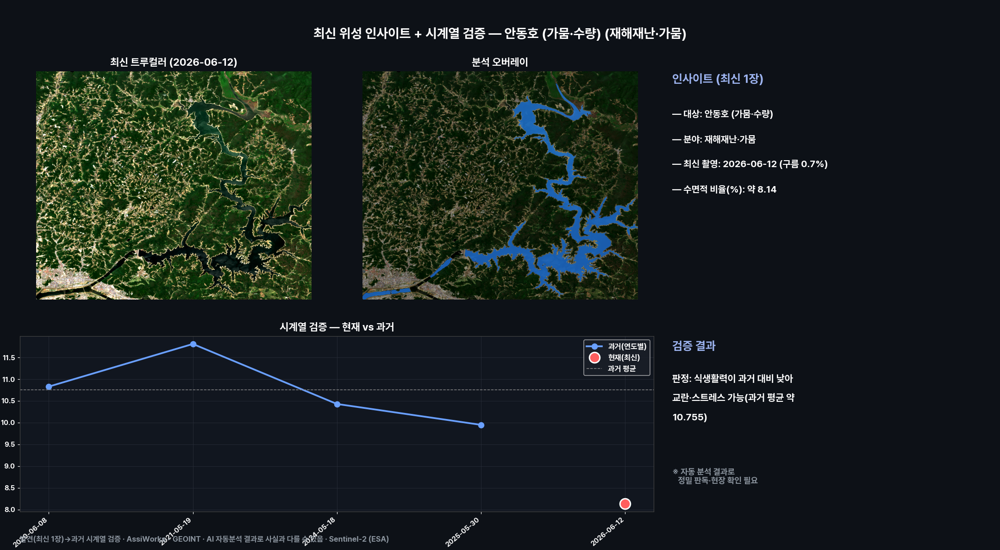
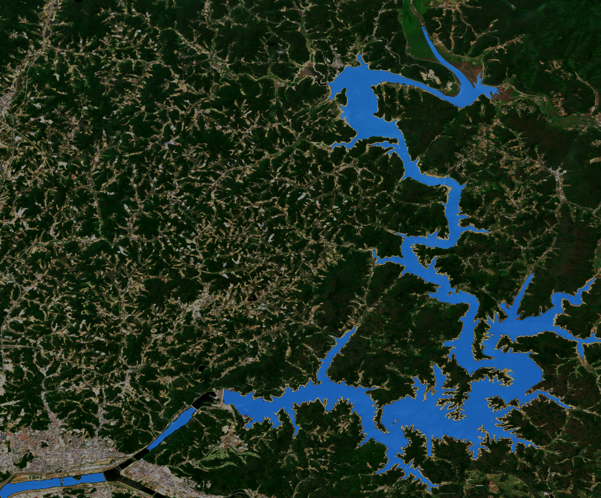
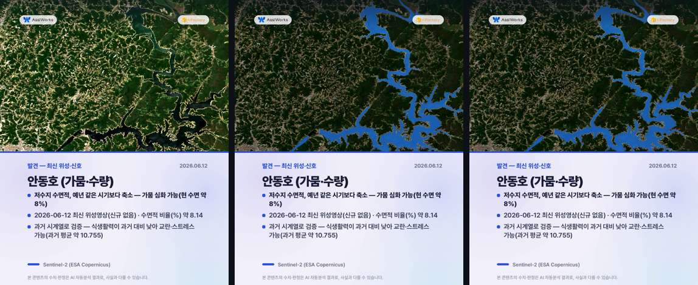
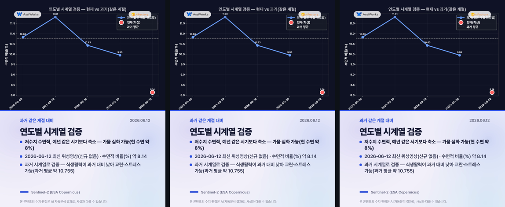
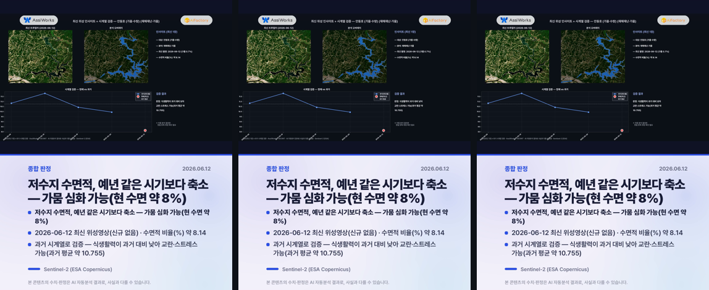

# 최신 위성 인사이트 — 안동호 (가뭄·수량) (재해재난·가뭄)

**발행**: 2026-06-15 14시 · **분야**: 재해재난·가뭄 · **센서**: Sentinel-2 L2A (ESA) · 10 m
**원본 촬영**: 2026-06-12 (구름 0.7%, 최신 위성영상(신규 장면 없어 최신 영상 사용))

> ⚠️ **추정치 안내**: 본 콘텐츠의 모든 수치·판정·해석은 AI·알고리즘이 위성영상을 자동 분석한 **추정 결과**로, 사실과 다를 수 있습니다. 공식 통계·현장 확인과 차이가 있을 수 있으므로 참고용으로만 활용하시기 바랍니다.

---

## 핵심 발견
> **저수지 수면적, 예년 같은 시기보다 축소 — 가뭄 심화 가능(현 수면 약 8%)**

## 1단계 — 발견 (최신 1장)
- 2026-06-12 촬영 영상에서 재해재난·가뭄 신호 분석.
- 수면적 비율(%): 약 8.14.
- 분석창 내 수면적 약 8.1%
- 예년 같은 시기와 비교해 가뭄(축소)·수량(확대) 변화 점검

## 2단계 — 시계열 검증
동일 지역 과거 청천 영상(4개)과 비교해 검증합니다.
- 과거: 06-08 10.83, 05-19 11.81, 05-18 10.43, 05-30 9.95
- 현재: 06-12 약 8.14
- **판정: 식생활력이 과거 대비 낮아 교란·스트레스 가능(과거 평균 약 10.755)**
- ※ 자동 분석 결과로 정밀 판독·현장 확인이 필요합니다. (산사태·불법건축물·해변쓰레기·고사목 등 미세 대상은 고해상 영상 병행 권장)

## 분석 종합 (발견 + 검증)

## 분석 오버레이

## 영상카드 (미리보기)

_아래는 각 영상의 대표 장면입니다. 영상은 링크에서 재생/다운로드._

▶️ [card1_discovery.mp4 영상 보기](videocards/card1_discovery.mp4)

▶️ [card2_timeseries.mp4 영상 보기](videocards/card2_timeseries.mp4)

▶️ [card3_summary.mp4 영상 보기](videocards/card3_summary.mp4)

---
_AssiWorks - GEOINT · 2026-06-15 14시 · Sentinel-2 (ESA)_
